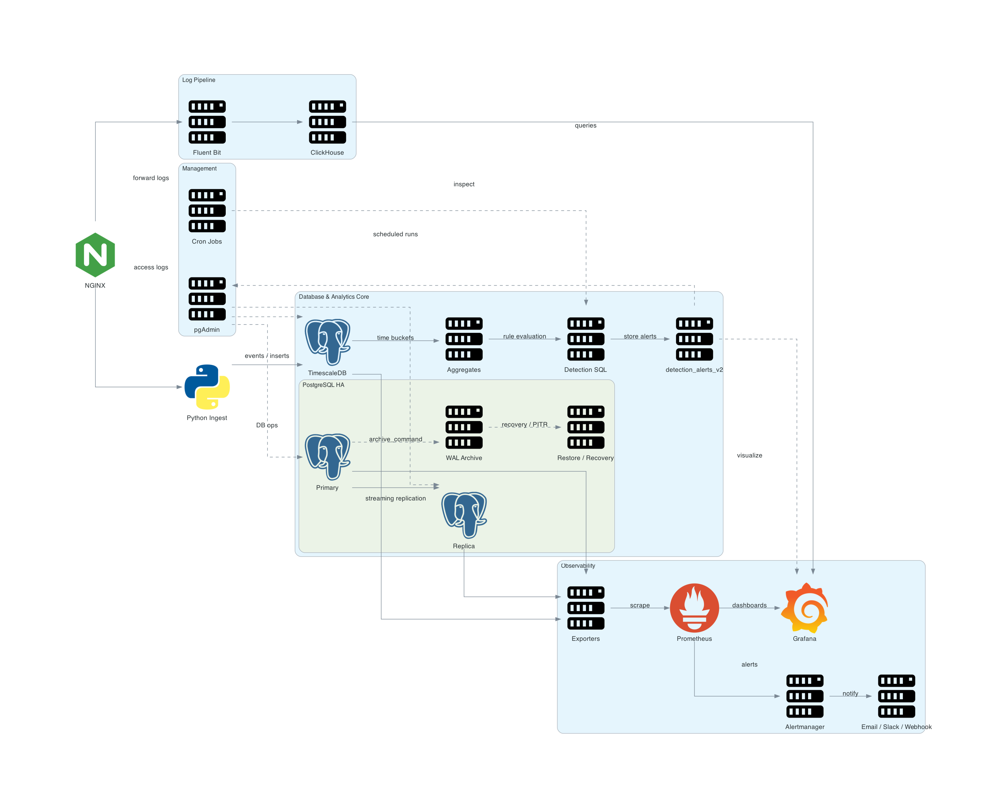
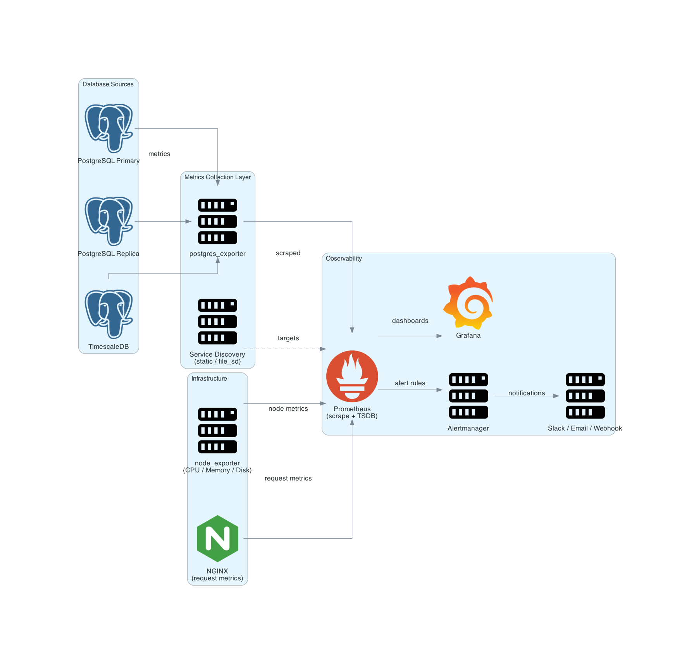
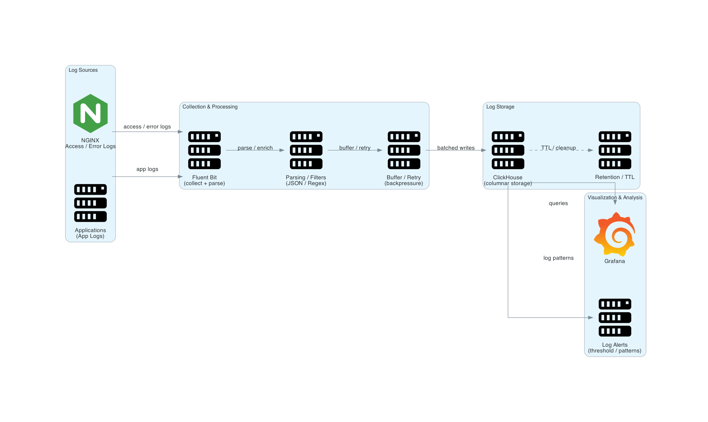
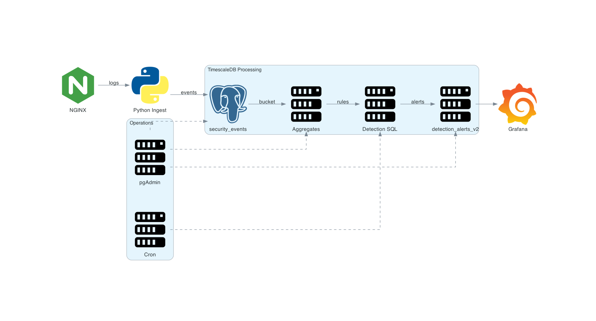

#  Self-Hosted Data Platform

A production-style, self-hosted data platform designed to simulate real-world **observability, log analytics, and detection systems** within a homelab environment.

This platform integrates **databases, monitoring, logging, and SQL-based detection pipelines** into a cohesive system focused on reliability, visibility, and operational workflows.

---

##  Overview

The platform is built around three core capabilities:

* **Metrics Observability** → system + database monitoring
* **Log Analytics** → structured log ingestion and querying
* **Detection Engine** → SQL-driven security/event detection

All components are self-hosted and interconnected to replicate **real production data flows**.

---

##  Architecture



The system is composed of:

* PostgreSQL HA cluster with WAL archiving
* TimescaleDB for time-series analytics
* Prometheus-based observability stack
* Fluent Bit → ClickHouse log pipeline
* SQL-driven detection engine with scheduled execution

---

##  Core Components

| Layer             | Technologies                      | Purpose                                     |
| ----------------- | --------------------------------- | ------------------------------------------- |
| **Database**      | PostgreSQL, TimescaleDB           | transactional + time-series storage         |
| **Observability** | Prometheus, Grafana, Alertmanager | metrics collection, visualization, alerting |
| **Logs**          | Fluent Bit, ClickHouse            | log ingestion and analytics                 |
| **Detection**     | SQL (TimescaleDB)                 | rule-based anomaly detection                |
| **Management**    | pgAdmin, Cron (mgmt VM)           | operations and automation                   |

---

##  Data Pipelines

###  Metrics Pipeline



* Exporters expose database + node metrics
* Prometheus scrapes and stores time-series data
* Grafana provides dashboards
* Alertmanager handles alert routing

---

###  Log Analytics Pipeline



* NGINX and application logs are collected
* Fluent Bit parses and forwards logs
* ClickHouse stores logs in columnar format
* Grafana enables log querying and visualization

---

###  Detection Pipeline



* Logs → Python ingest → TimescaleDB (`security_events`)
* Aggregations computed using time buckets
* SQL rules evaluate anomalies
* Alerts stored in `detection_alerts_v2`
* Grafana dashboards visualize alerts

---

##  Detection Engine

The detection system runs as a **scheduled SQL execution pipeline**:

* Triggered every minute via cron
* Operates on aggregated time-series data
* Produces structured alerts stored in PostgreSQL

### Example Rules

**Request Rate Spike**

* HIGH ≥ 300 req/min
* MEDIUM ≥ 100 req/min

**Single IP Dominance**

* HIGH ≥ 50%
* MEDIUM ≥ 30%

---

##  Key SQL Patterns

```sql
-- time-based aggregation
time_bucket('1 minute', time)

-- JSON extraction
raw_event->>'ip'

-- window function
SUM(count(*)) OVER (...)

-- deduplication
ON CONFLICT DO NOTHING
```

These patterns enable efficient **time-series aggregation, anomaly detection, and deduplicated alerting**.

---

##  Alert Storage Design

Table: `detection_alerts_v2`

* Standard PostgreSQL table (not hypertable)
* Supports **unique constraints for deduplication**
* Optimized for **alert querying and inspection**

---

##  Automation

Detection queries are executed via cron:

```bash
* * * * * /usr/bin/psql -h <DB> -U <USER> -d metrics -f detect.sql
```

This enables **continuous evaluation without external orchestration tools**.

---

##  Operations (pgAdmin)

pgAdmin is used for:

* Query debugging and validation
* Aggregate verification
* Alert inspection
* Schema management

---

## ⚠️ Key Engineering Challenges

* Correct log ingestion source (edge vs management network)
* TimescaleDB limitations with unique constraints
* Silent cron execution debugging
* PostgreSQL connection mismatches across services
* Python environment restrictions (PEP 668)

---

##  Limitations

* Rule-based detection only (no ML/AI models)
* Batch execution (no real-time streaming)
* No automated response/remediation system

---

##  Future Improvements

* Real-time streaming (Kafka / Redpanda)
* OpenTelemetry-based unified observability
* Distributed ClickHouse cluster
* Advanced detection (behavioral / anomaly models)
* Automated alert response workflows

---

##  Project Scope

This project is designed to demonstrate:

* End-to-end data platform architecture
* Observability and monitoring design
* Log ingestion and analytics pipelines
* SQL-based detection systems
* Production-style debugging and operations

---

##  Summary

This platform replicates a **mini production data ecosystem**, combining:

* infrastructure observability
* log analytics
* detection engineering

into a single, self-hosted system suitable for experimentation, learning, and portfolio demonstration.
